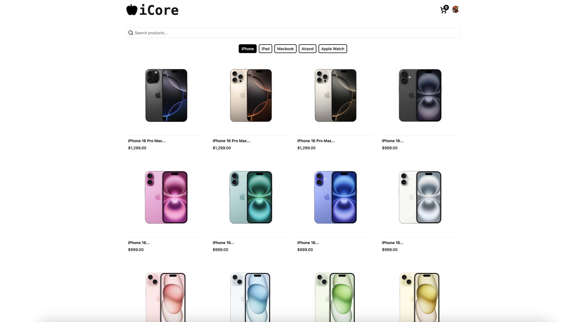

# Snap-Shop 🛒

## Description 📚

Snap-Shop is a comprehensive e-commerce web application built with Next.js, designed to allow users to browse products, manage a cart, register, log in, authenticate, and utilize a dashboard for order and account management. It leverages modern web technologies and frameworks to provide a robust and user-friendly shopping experience.

## Demo 🎥

#### **Project Demo** : [e-commerce web Vd Demo](https://drive.google.com/file/d/16BOw26JqHRnalH7-1NAL09g2pWOS98IK/view?usp=sharing)

#### **Home Page**



## Features 👾

- **User Authentication:** Secure login, registration, and password reset functionalities.
- **Product Browsing:** Display and browse products with detailed information.
- **Shopping Cart:** Add items to cart, view cart contents, and proceed to checkout.
- **Payment Processing:** Integration with Stripe for secure payment processing.
- **User Account Management:** Profile management, settings adjustments, and two-factor authentication.
- **Dashboard:** Order management and analytics dashboard for administrators.
- **Product Management:** Product creation and management capabilities within the dashboard.
- **Image Uploading:** Utilizes Uploadthing for image uploads.
- **Responsive Design:** Implemented with Tailwind CSS for a consistent user experience across devices.
- **Database Interaction:** Uses Drizzle ORM for efficient database interactions.
- **Email Functionality:** Integration with Resend for email confirmations and password resets.

## Installation ⚔️

To get started with Snap-Shop, follow these installation steps:

1.  **Clone the Repository:**

    ```bash
    git clone <repository_url>
    cd snap-shop
    ```

2.  **Install Dependencies:**

    ```bash
    npm install
    ```

3.  **Set up Environment Variables:**

    Create a `.env.local` file in the root directory and configure the required environment variables. Key variables include:

    - `DATABASE_URL`: Connection string for your PostgreSQL database (e.g., from Neon).
    - `NEXTAUTH_SECRET`: A secret for NextAuth.
    - `NEXTAUTH_URL`: The base URL of your application.
    - `STRIPE_SECRET_KEY`: Your Stripe secret key.
    - `STRIPE_WEBHOOK_SECRET`: Your Stripe webhook secret.
    - `UPLOADTHING_SECRET`: Secret for Uploadthing
    - `UPLOADTHING_APP_ID`: App ID for Uploadthing
    - `RESEND_API_KEY`: Your Resend API key.

4.  **Database Setup:**

    - Run database migrations using Drizzle Kit:

    ```bash
    npm run db:push  # Or npm run db:generate if you need to generate migrations
    ```

5.  **Run the Application:**

    ```bash
    npm run dev
    ```

    This will start the development server. You can then access the application in your web browser, typically at `http://localhost:3000`.

## Usage Examples 🤝

- **Accessing the Homepage:** Navigate to the root URL (e.g., `http://localhost:3000`) to view the homepage (`app/page.tsx`).
- **User Authentication:**
  - Register a new user through the registration page (`app/auth/register/page.tsx`).
  - Log in with your credentials via the login page (`app/auth/login/page.tsx`).
- **Product Detail Page:** View product details by navigating to `/products/[id]` (e.g., `/products/123`).
- **Dashboard Access:** Log in and access the dashboard by navigating to `/dashboard`.
- **Server Actions Example:** The application likely uses server actions in `server/actions/*` to handle form submissions, such as login (`server/actions/login-action.ts`), registration (`server/actions/register-action.ts`), and password resets (`server/actions/reset-password.ts`).

## Tech Stack and Dependencies 🧑🏻‍🔧

- **Languages:** TypeScript, JavaScript, Postgresql
- **Frameworks:** Next.js, React
- **Styling:** Tailwind CSS
- **Database:** Drizzle ORM, PostgreSQL (via Neon or similar)
- **Authentication:** NextAuth
- **State Management:** Zustand
- **Form Handling:** React Hook Form
- **Payment Processing:** Stripe
- **File Uploads:** Uploadthing
- **UI Components:** Radix UI, Recharts, Vaul, Sonner, Shadcn
- **Other Dependencies:** Zod (validation), bcrypt, date-fns, Resend, various UI component libraries.

## Project Structure Overview 🦾

```
snap-shop/
├── app/                    # Next.js application routes and components
│   ├── auth/               # Authentication routes (login, register, reset password)
│   ├── dashboard/          # Dashboard routes and components
│   ├── products/           # Product related routes
│   ├── api/                # API routes (NextAuth, Uploadthing)
│   ├── layout.tsx          # Main application layout
│   └── page.tsx            # Homepage
├── components/             # Reusable React components
│   ├── cart/               # Cart related components
│   ├── auth/               # Authentication components
│   ├── navigation/         # Navigation components
│   ├── setting/            # User setting components
│   ├── products/           # Product display and management components
│   ├── ui/                 # UI components (button, input, etc.)
│   ├── analytics/          # Analytics components
│   └── ...
├── lib/                    # Utility functions and helpers
├── store/                  # Zustand store for state management (e.g., cart)
├── server/                 # Server-side logic
│   ├── actions/            # Server actions
│   ├── migrations/         # Database migrations
│   ├── schema.ts           # Database schema
│   └── index.ts            # Server entry point
├── types/                  # TypeScript type definitions
├── public/                 # Static assets (images, etc.)
├── drizzle.config.ts       # Drizzle configuration
├── next.config.ts          # Next.js configuration
├── package.json            # Project dependencies and scripts
├── tsconfig.json           # TypeScript configuration
└── README.md               # This README file
```

## Contributing 🤍

Contributions are welcome! Please follow these guidelines:

1.  **Fork the repository.**
2.  **Create a new branch** for your feature or bug fix.
3.  **Make your changes** and commit them with clear, concise messages.
4.  **Test your changes** thoroughly.
5.  **Submit a pull request.**

## License

This project is licensed under the [MIT License](LICENSE).
